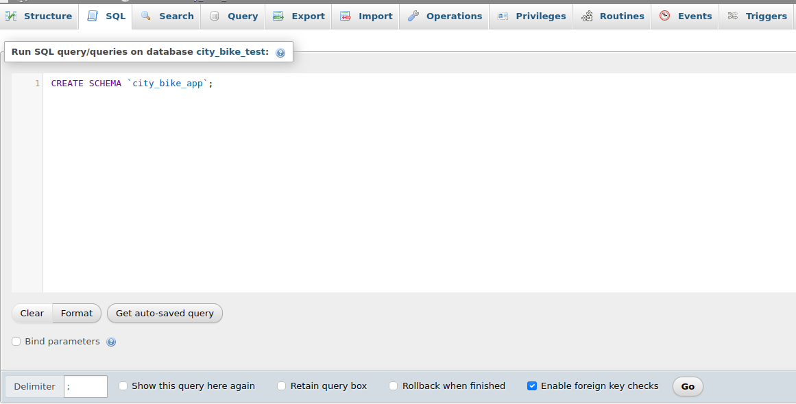
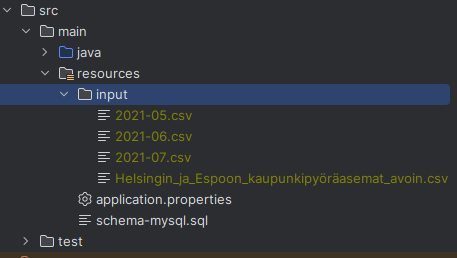

# Helsinki Bike Data Import
This project is part of my submission to [Solita dev academy 2023](https://github.com/solita/dev-academy-2023-exercise). It consists of a program to import and validate Helsinki and Espoo's city bike stations data, as well as data of journeys taken in the summer of 2021. The application was built using Java and the [Spring framework](https://spring.io/), more specifically [Spring Batch](https://spring.io/projects/spring-batch).

The reason I chose Java is that, as of right now, it is the language I have the most experience on, and I am quite comfortable developing in this language. Spring's ecosystem also took an important role in the decision, as it is extremely flexible, and it met all my needs: from building a web application to running jobs to import and validate the stations and journeys data.

## Prerequisites
- Java 17
- Docker and docker compose plugin
- Maven 3.5+
## Configuration
Before running a job to import either stations or journeys, you should have a local database up and running. If you haven't done that yet, you can follow [these instructions](https://github.com/SRH8/hel-bike-api#setting-up-the-database) to set up a local database.

**_NOTE:_**  remember that the docker compose file provided [here]((https://github.com/SRH8/hel-bike-api#setting-up-the-database)) will also create a phpMyAdmin container that you can use as client!

Once you have set up the database, make sure the city_bike_app schema has been created. Otherwise, you will need to create it manually. You can do so by following the instructions below:

You can use any MySQL client, however I will be using phpMyAdmin for this part.

### Creating a schema

- Access phpMyAdmin through your browser. You can use root as username and password.
  ```
  http://localhost:8081/
  ```
- Go to the SQL tab and paste the statement below. To create the schema click on the Go button.

  ```
  CREATE SCHEMA `city_bike_app`;
  ```
  <p align="center">
  
  </p>
  
Once you have the schema created, you are ready to import the data. The program will create all the necessary tables and import the data.
## Run Locally

Clone the project

```bash
  git clone https://github.com/SRH8/hel-bike-data-import.git
```

Go to the project directory

```bash
  cd hel-bike-data-import
```

Install dependencies

```bash
  ./mvnw install
```

Edit application.properties. The property spring.batch.job.name tells spring batch which job you want to run. By default, it is set to import stations:
```
spring.batch.job.name=importStationsJob
```

**_NOTE:_** the stations data file is already provided to you
  
When you want to import journeys, change the property so that it will execute the import journeys job
```
spring.batch.job.name=importJourneysJob
```

**_NOTE:_** importing millions of rows of journey data takes around 25 or 30 minutes, so in order to facilitate the reviewing process, I have provided a smaller file with around 12.000 journeys to import.
However, if you still wish to import all the journeys, make sure to remove the existing file in the input directory, download the [data files](https://github.com/SRH8/hel-bike-data-import#data-files), and add put them in the input folder. 
  
If you added the journey data files, make sure they keep their original names
<p align="center">
  
  </p>


Start the program to execute the job defined in application.properties

```bash
  ./mvnw spring-boot:run
```

## Running Tests

To run tests, run the following command

```bash
  ./mvnw clean test
```
## Data files
### Journeys
- https://dev.hsl.fi/citybikes/od-trips-2021/2021-05.csv
- https://dev.hsl.fi/citybikes/od-trips-2021/2021-06.csv
- https://dev.hsl.fi/citybikes/od-trips-2021/2021-07.csv

### Stations
- https://opendata.arcgis.com/datasets/726277c507ef4914b0aec3cbcfcbfafc_0.csv
## Licenses
Station data is owned by [Helsinki Region Transport’s (HSL)](https://www.avoindata.fi/data/en_GB/dataset/hsl-n-kaupunkipyoraasemat/resource/a23eef3a-cc40-4608-8aa2-c730d17e8902?inner_span=True)

Journeys data is owned by [City Bike Finland](https://www.citybikefinland.fi/)